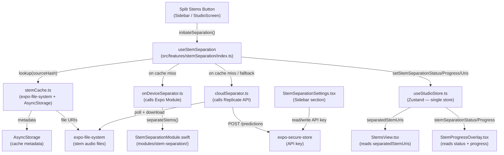
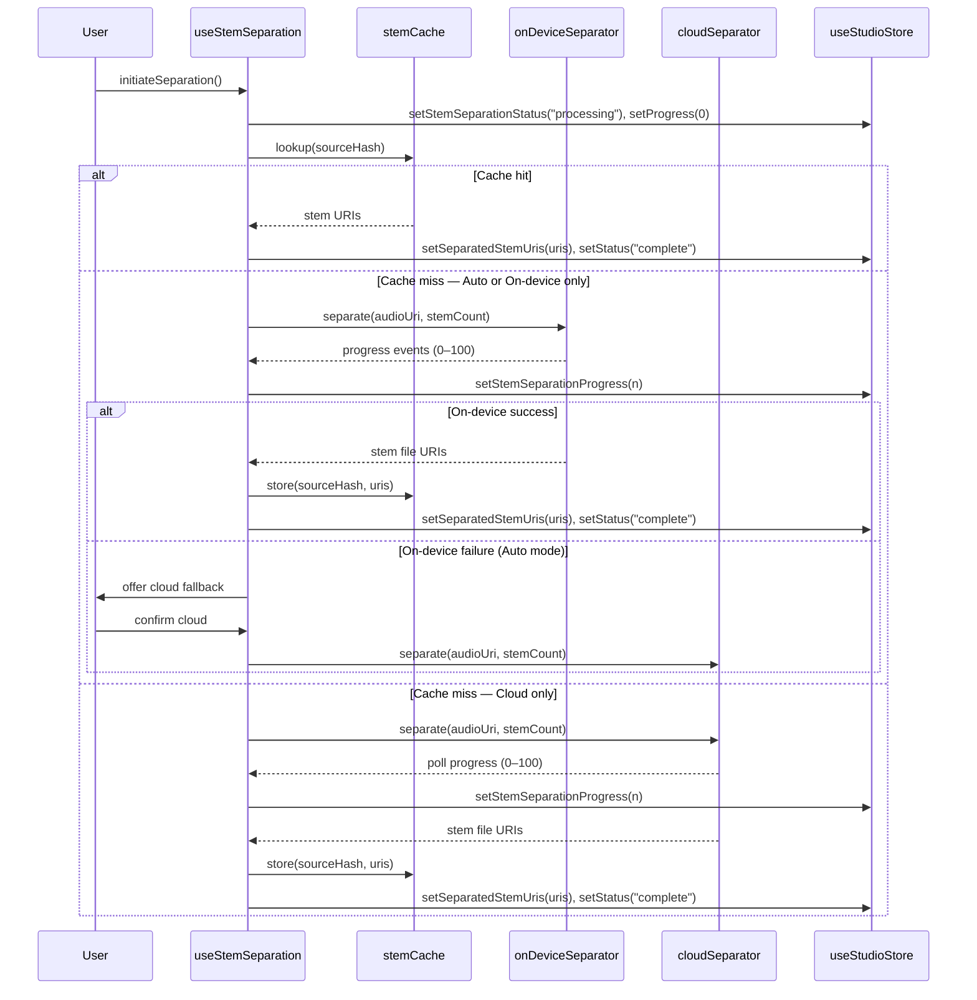

# Design Document: Demucs Stem Separation

## Overview

This feature adds hybrid stem separation to BeatNote, allowing choreographers to split a loaded audio file into individual instrument stems (vocals, drums, bass, piano, guitar, other) using either on-device CoreML inference or the Replicate cloud API. The system is exposed as a single "Split Stems" action, automatically selects the processing tier based on device capability and user preference, caches results for instant reload, and integrates separated stems into the existing layer-based waveform display.

The implementation follows the existing BeatNote architecture: all state lives in the single Zustand store (ADR-001), native iOS code is written as an Expo Module (ADR-003), and the hybrid on-device/cloud approach is used (ADR-004). No new global stores are introduced.

---

## Architecture

### High-Level Component Diagram



### Processing Flow



---

## Components and Interfaces

### `src/features/stemSeparation/types.ts`

All shared types for the feature.

```typescript
import { LayerId } from '../../hooks/useStudioStore';

export type StemSeparationStatus = 'idle' | 'processing' | 'complete' | 'error';
export type StemSeparationMode = 'auto' | 'on-device' | 'cloud';

export interface StemSeparationResult {
  sourceHash: string;
  stemCount: 4 | 6;
  stems: Partial<Record<LayerId, string>>; // LayerId → file URI
  createdAt: string; // ISO timestamp
}

export interface StemCacheEntry extends StemSeparationResult {}

export interface StemCacheMetadata {
  entries: Record<string, StemCacheEntry>; // keyed by sourceHash
}

export interface StemProgressEvent {
  progress: number; // 0–100
}

export interface StemSeparationError {
  code: 'NO_SONG' | 'ALREADY_PROCESSING' | 'NO_API_KEY' | 'NETWORK_ERROR' |
        'API_ERROR' | 'DEVICE_ERROR' | 'STORAGE_ERROR' | 'UNSUPPORTED_FORMAT' |
        'MODEL_MISSING' | 'INSUFFICIENT_MEMORY';
  message: string;
}
```

### `src/features/stemSeparation/index.ts` — Public API

```typescript
export { useStemSeparation } from './useStemSeparation';
export type { StemSeparationStatus, StemSeparationMode, StemSeparationResult } from './types';
```

### `src/features/stemSeparation/useStemSeparation.ts`

The orchestration hook. Reads from the store, coordinates cache lookup, on-device/cloud dispatch, and writes results back to the store.

```typescript
interface UseStemSeparationReturn {
  initiateSeparation: () => Promise<void>;
  cancelSeparation: () => void;
}

export function useStemSeparation(): UseStemSeparationReturn
```

Key responsibilities:
- Reads `songLoaded`, `stemCount`, and the current audio URI from the store
- Computes `sourceHash` via `stemCache.computeHash(audioUri, stemCount)`
- Checks cache before dispatching to a separator
- In Auto mode: tries on-device first, offers cloud on failure
- Dispatches progress events to the store via `setStemSeparationProgress`
- Writes final URIs to the store via `setSeparatedStemUris`
- Exposes `cancelSeparation()` which delegates to the active separator

### `src/features/stemSeparation/onDeviceSeparator.ts`

Thin wrapper around the native Expo Module.

```typescript
export interface OnDeviceSeparatorOptions {
  audioUri: string;
  stemCount: 4 | 6;
  onProgress: (progress: number) => void;
}

export async function separateOnDevice(
  options: OnDeviceSeparatorOptions
): Promise<Partial<Record<LayerId, string>>>

export function cancelOnDevice(): void
```

### `src/features/stemSeparation/cloudSeparator.ts`

Handles Replicate API submission, polling, and file download.

```typescript
export interface CloudSeparatorOptions {
  audioUri: string;
  stemCount: 4 | 6;
  apiKey: string;
  onProgress: (progress: number) => void;
  signal: AbortSignal; // for cancellation
}

export async function separateCloud(
  options: CloudSeparatorOptions
): Promise<Partial<Record<LayerId, string>>>
```

Internal flow:
1. POST to `https://api.replicate.com/v1/predictions` with model `facebook/demucs`
2. Poll `GET /v1/predictions/{id}` every 2 seconds until `status` is `succeeded` or `failed`
3. Map Replicate status to progress: `starting→5`, `processing→5–95` (linear), `succeeded→100`
4. On success: download each output URL to `expo-file-system` Documents directory
5. Return `LayerId → local file URI` mapping

### `src/features/stemSeparation/stemCache.ts`

```typescript
export function computeHash(audioUri: string, stemCount: 4 | 6): string

export async function lookupCache(
  sourceHash: string
): Promise<StemCacheEntry | null>

export async function storeCache(entry: StemCacheEntry): Promise<void>

export async function deleteCache(sourceHash: string): Promise<void>

export async function getAllCacheEntries(): Promise<StemCacheEntry[]>

export async function getCacheSize(): Promise<number> // bytes
```

### `src/components/ui/overlay/StemProgressOverlay.tsx`

Modal overlay shown during processing.

Props: none (reads directly from store)

Displays:
- Progress bar (`stemSeparationProgress`)
- Estimated time remaining (computed from progress rate and song duration)
- Cancel button → calls `cancelSeparation()` from `useStemSeparation`

### `src/components/ui/settings/StemSeparationSettings.tsx`

New sidebar section added to `Sidebar.tsx`.

Displays:
- Mode selector: Auto / On-device only / Cloud only (stored in AsyncStorage under `beatnote_stem_mode`)
- Replicate API key input (reads/writes via `expo-secure-store` key `beatnote_replicate_key`)
- Warning when mode is "Cloud only" and no key is stored
- Link to Storage management screen

### `modules/stem-separation/src/index.ts` — Native Module TS Interface

```typescript
import { NativeModule, requireNativeModule } from 'expo-modules-core';

interface StemSeparationModuleEvents {
  onProgress: (event: { progress: number }) => void;
}

interface StemSeparationNativeModule extends NativeModule<StemSeparationModuleEvents> {
  separateStems(
    audioUri: string,
    stemCount: number
  ): Promise<Record<string, string>>; // stem name → file URI

  cancelSeparation(): void;
}

export default requireNativeModule<StemSeparationNativeModule>('StemSeparation');
```

---

## Data Models

### Store Additions (`useStudioStore.ts`)

```typescript
// State fields to add
stemSeparationStatus: StemSeparationStatus;   // default: 'idle'
stemSeparationProgress: number;               // default: 0, range 0–100
separatedStemUris: Partial<Record<LayerId, string>>; // default: {}

// Actions to add
setStemSeparationStatus: (status: StemSeparationStatus) => void;
setStemSeparationProgress: (progress: number) => void;
setSeparatedStemUris: (uris: Partial<Record<LayerId, string>>) => void;
```

All three actions use the simple `set({})` form since they do not derive from existing state.

### Cache Metadata Schema (AsyncStorage key: `beatnote_stem_cache`)

```typescript
interface StemCacheMetadata {
  entries: {
    [sourceHash: string]: {
      sourceHash: string;
      stemCount: 4 | 6;
      stems: { [layerId: string]: string }; // LayerId → file URI
      createdAt: string; // ISO 8601
    }
  }
}
```

### Source Hash

`sourceHash = sha256(audioUri + ":" + stemCount.toString())`

Implemented using a pure JS SHA-256 (e.g. `js-sha256`) — no native dependency needed. The hash is truncated to 16 hex characters for use as a directory name.

### Stem File Layout (`expo-file-system` Documents directory)

```
<DocumentsDir>/
  beatnote_stems/
    <sourceHash>/
      vocals.m4a
      drums.m4a
      bass.m4a
      piano.m4a      (6-stem only)
      guitar.m4a     (6-stem only)
      other.m4a
```

### Replicate API Payload

```typescript
// POST /v1/predictions
{
  version: "...", // facebook/demucs latest version hash
  input: {
    audio: "<base64 or URL>",
    stem: stemCount === 6 ? "htdemucs_6s" : "htdemucs",
    mp3_bitrate: 320,
    float32: false,
    output_format: "mp3"
  }
}
```

---

## Native Module Contract

### Swift: `modules/stem-separation/ios/StemSeparationModule.swift`

```swift
import ExpoModulesCore
import CoreML
import AVFoundation

public class StemSeparationModule: Module {
  public func definition() -> ModuleDefinition {
    Name("StemSeparation")

    Events("onProgress")

    AsyncFunction("separateStems") { (audioUri: String, stemCount: Int, promise: Promise) in
      // 1. Load CoreML model (htdemucs or htdemucs_6s based on stemCount)
      // 2. Decode audio file at audioUri
      // 3. Run inference on Neural Engine
      // 4. Emit onProgress events during processing
      // 5. Write output stems to Documents directory
      // 6. Resolve promise with { "vocals": fileUri, "drums": fileUri, ... }
    }

    Function("cancelSeparation") {
      // Cancel in-progress inference
    }
  }
}
```

Key implementation notes:
- Model files bundled as `.mlmodelc` in the app bundle under `Resources/`
- Inference dispatched on a background queue; progress emitted via `sendEvent("onProgress", ["progress": value])`
- Output written to `FileManager.default.urls(for: .documentDirectory)` under `beatnote_stems/<hash>/`
- On model load failure: `promise.reject("MODEL_MISSING", "CoreML model file not found or corrupted")`
- On memory pressure: `promise.reject("INSUFFICIENT_MEMORY", "...")`

---

## Waveform Integration

`StemsView` currently passes `audioUri` (the full-mix URI) to every `StemWaveform` child. After separation, each layer should use its own stem URI.

The change is minimal: `StemsView` reads `separatedStemUris` from the store and passes the per-layer URI (falling back to the full-mix URI) to each `StemWaveform`:

```typescript
// Inside StemsView, per-stem render:
const stemAudioUri = separatedStemUris[stem.id as LayerId] ?? audioUri;
<StemWaveform audioUri={stemAudioUri} ... />
```

`WaveformCanvas` (unified view) is unchanged — it always receives the original `audioUri` prop from `StudioScreen`. No changes to `useWaveformData` are needed since it already accepts any URI.

---

## Settings Integration

`Sidebar.tsx` gains a new `<StemSeparationSettings />` section. The component is self-contained and reads/writes:

- `beatnote_stem_mode` in AsyncStorage (`'auto' | 'on-device' | 'cloud'`)
- `beatnote_replicate_key` in `expo-secure-store`

The API key is never logged, never stored in AsyncStorage, and never included in project files.

---

## Error Handling Strategy

All errors flow through a consistent path:

1. The separator (on-device or cloud) throws a typed `StemSeparationError`
2. `useStemSeparation` catches it, calls `setStemSeparationStatus('error')`, and logs via `console.error` with context
3. The error message is surfaced to the user via the existing `ErrorModal` pattern (same as `useCustomAudioPlayer`)

| Error Code | Trigger | User Message |
|---|---|---|
| `NO_SONG` | Split Stems tapped with no song loaded | "Load a song before splitting stems." |
| `ALREADY_PROCESSING` | Second tap while processing | (button disabled — no modal needed) |
| `NO_API_KEY` | Cloud mode, no key in SecureStore | "Enter a Replicate API key in Settings → Stem Separation." |
| `NETWORK_ERROR` | No internet for cloud | "Internet connection required for cloud separation." |
| `API_ERROR` | Replicate returns error | "Replicate API error: {message}. Check your API key in Settings." |
| `DEVICE_ERROR` | CoreML inference failure | "On-device separation failed. Try closing other apps or use cloud separation." |
| `STORAGE_ERROR` | Insufficient disk space | "Not enough storage. Free up space via Settings → Storage." |
| `UNSUPPORTED_FORMAT` | Audio format not supported by Demucs | "Unsupported audio format. Supported formats: MP3, WAV, M4A, FLAC." |
| `MODEL_MISSING` | CoreML model file absent/corrupt | "On-device model unavailable. Use cloud separation instead." |
| `INSUFFICIENT_MEMORY` | Device OOM during inference | "Not enough memory. Close other apps or use cloud separation." |

Auto-mode fallback: when `DEVICE_ERROR`, `MODEL_MISSING`, or `INSUFFICIENT_MEMORY` occurs in Auto mode, `useStemSeparation` does not immediately show an error — instead it presents a confirmation dialog offering to retry via cloud.

---

## Correctness Properties

*A property is a characteristic or behavior that should hold true across all valid executions of a system — essentially, a formal statement about what the system should do. Properties serve as the bridge between human-readable specifications and machine-verifiable correctness guarantees.*

### Property 1: Cache round-trip

*For any* audio URI and stem count, storing a separation result in the cache and then looking it up by the same source hash should return an entry with identical stem URIs, stem count, and source hash.

**Validates: Requirements 1.1, 1.2, 5.1, 5.3**

### Property 2: Hash determinism

*For any* (audioUri, stemCount) pair, calling `computeHash` multiple times should always return the same string.

**Validates: Requirements 5.2**

### Property 3: Cache metadata completeness

*For any* stored cache entry, the retrieved entry should contain all four required fields: `sourceHash`, `stemCount`, `stems` (with at least one LayerId key), and `createdAt`.

**Validates: Requirements 5.4**

### Property 4: Cache deletion is a left inverse of storage

*For any* source hash that has been stored in the cache, deleting it and then looking it up should return null.

**Validates: Requirements 5.6**

### Property 5: Stem count output keys

*For any* successful separation with stemCount=4, the result keys should be exactly `{vocals, drums, bass, other}`. For stemCount=6, the result keys should be exactly `{vocals, drums, bass, piano, guitar, other}`.

**Validates: Requirements 2.2, 2.3**

### Property 6: Separation produces existing file URIs

*For any* successful separation (on-device or cloud), every LayerId in the result should map to a file URI that exists on the file system.

**Validates: Requirements 2.6, 3.4**

### Property 7: Progress values are monotonically non-decreasing and bounded

*For any* separation run, the sequence of progress values emitted should be non-decreasing and every value should be in the range [0, 100].

**Validates: Requirements 2.4, 3.3, 4.1**

### Property 8: Store state transitions on separation lifecycle

*For any* separation initiation, the store should have `stemSeparationStatus = "processing"` and `stemSeparationProgress = 0` immediately after start. On successful completion, `stemSeparationStatus = "complete"` and `stemSeparationProgress = 100`.

**Validates: Requirements 4.5, 4.6**

### Property 9: Store invariants

*For any* sequence of store actions, `stemSeparationStatus` should always be one of `{idle, processing, complete, error}`, `stemSeparationProgress` should always be in [0, 100], and all keys in `separatedStemUris` should be valid `LayerId` values.

**Validates: Requirements 6.1, 6.2, 6.3**

### Property 10: In-progress guard

*For any* store state where `stemSeparationStatus = "processing"`, calling `initiateSeparation` again should leave the status unchanged (still "processing") and not start a second separation.

**Validates: Requirements 1.7**

### Property 11: View mode toggle does not trigger re-separation

*For any* store state where `separatedStemUris` is populated, toggling `viewMode` between "unified" and "multitrack" should not change `separatedStemUris` or `stemSeparationStatus`.

**Validates: Requirements 9.3**

### Property 12: WaveformCanvas URI invariant

*For any* store state (with or without `separatedStemUris` populated), the URI passed to `WaveformCanvas` should always equal the original full-mix audio URI, never a stem URI.

**Validates: Requirements 9.4, 6.6**

### Property 13: Estimated time remaining is non-negative

*For any* (songDuration, currentProgress, elapsedMs) triple where progress > 0, the computed estimated time remaining should be a non-negative number.

**Validates: Requirements 4.2**

---

## Testing Strategy

### Unit Tests (Jest)

Target: `tests/unit/` — pure logic only, no React/RN environment needed.

**`stemCache.test.ts`**
- Property 1: cache round-trip (store then lookup returns identical entry)
- Property 2: hash determinism (same inputs → same hash, across 100+ random URI/stemCount pairs)
- Property 3: metadata completeness (all four fields present after store)
- Property 4: deletion inverse (store → delete → lookup returns null)
- Edge case: lookup on empty cache returns null
- Edge case: storing two entries with different hashes does not overwrite either

**`cloudSeparator.test.ts`**
- Property 7: progress sequence is non-decreasing and bounded (mock Replicate poll responses)
- Property 13: estimated time remaining is non-negative
- Example 3.1: correct Replicate endpoint and model are called
- Example 3.2: Authorization header contains the key from SecureStore
- Edge case 3.5: no API key → throws `NO_API_KEY` error
- Edge case 3.6: API error response → throws `API_ERROR` with message
- Edge case 3.7: network failure → throws `NETWORK_ERROR`

**`onDeviceSeparator.test.ts`**
- Property 5: stemCount=4 result has exactly {vocals, drums, bass, other} keys (mocked native module)
- Property 5: stemCount=6 result has exactly {vocals, drums, bass, piano, guitar, other} keys
- Property 7: progress events are non-decreasing and bounded
- Example 2.1: native module `separateStems` is called with correct arguments
- Edge case 2.7: native module rejection → throws `DEVICE_ERROR`
- Edge case 8.6: model missing error code → throws `MODEL_MISSING`

**`studioStore.test.ts`** (additions to existing file)
- Property 8: status and progress transitions on separation lifecycle
- Property 9: store invariants after any sequence of stem separation actions
- Property 10: in-progress guard (second initiation is a no-op)
- Example 6.4: setStemSeparationStatus, setStemSeparationProgress, setSeparatedStemUris update state correctly

**Property-based testing library**: `fast-check` (already compatible with Jest, no additional setup beyond `npm install fast-check --save-dev`)

Each property test runs a minimum of 100 iterations. Tag format in test comments:
```
// Feature: demucs-stem-separation, Property 1: Cache round-trip
```

### E2E Tests (Playwright)

Target: `tests/` — user-facing flows on web build.

Add to `tests/core-functionality.spec.ts` or a new `tests/stem-separation.spec.ts`:

- "Split Stems" button is visible when a song is loaded
- Tapping "Split Stems" shows the progress overlay with a progress bar and cancel button
- Cancelling separation dismisses the overlay and resets status to idle
- After successful separation (mocked via service worker or fixture), stems load into StemsView with per-layer waveforms
- Switching to unified view after separation shows the full-mix waveform (not a stem waveform)
- Settings sidebar shows stem separation mode selector and API key input
- Entering an API key in settings persists it (verified by re-opening settings)

### Unit Test Balance

Unit tests focus on the pure logic modules (`stemCache`, `cloudSeparator`, `onDeviceSeparator`, store actions). Property-based tests handle broad input coverage. E2E tests verify the integrated user-facing flows. React component rendering is not unit tested per project conventions.
