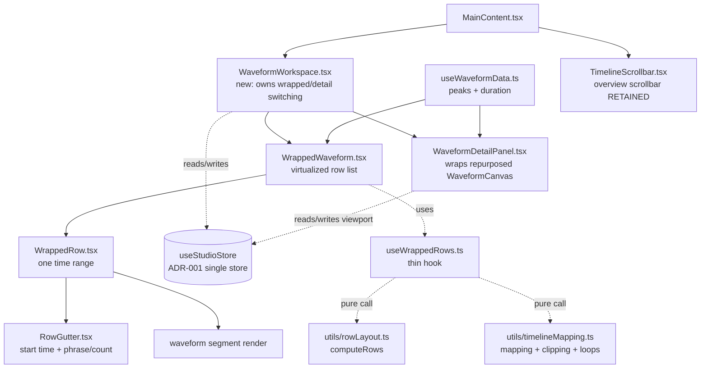
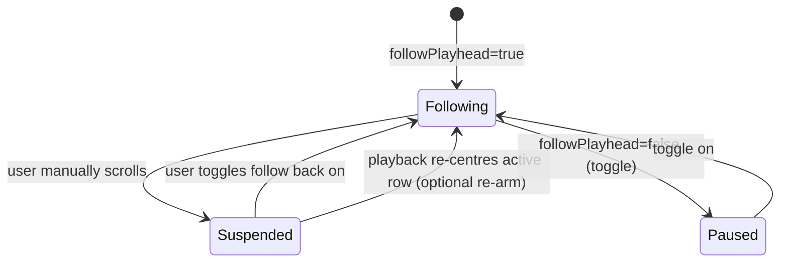

# Design Document: Wrapped Waveform Canvas

## Overview

BeatNote's primary waveform presentation is a single long horizontal track that the user
scrolls through a viewport. For choreography, that model forces constant horizontal panning and
makes it hard to see song structure at a glance. This feature replaces the primary presentation
with a **wrapped timeline**: time flows left to right across one row, then continues on the row
below, like lines of text or a musical score. Each row is a deterministic time range, ideally a
whole number of dance phrases (eight-counts), so a choreographer can read a whole song top to
bottom.

The wrapped view is an **overview and primary workspace**. A **continuous detailed waveform**
(the existing `WaveformCanvas`, repurposed) is retained as a **precision editing mode**. Both views
are *projections of the same underlying state* — identical timestamps, markers, annotations,
playback position, loop bounds, selected layer, and waveform peaks. Neither view stores its own
copy of marker or waveform data. Rows carry only *derived geometry* (`startMs`/`endMs` plus
optional phrase metadata), computed by pure functions and never persisted.

This design covers: the wrapped row model and the pure logic that computes it; the mapping formulas
between timestamps, rows, and pointer positions; progress clipping and multi-row loop geometry; the
component/hook/utility structure; virtualization and follow-playhead behaviour; wrapped↔detail mode
switching; portrait/landscape layouts; gesture handling that preserves vertical page scrolling; and
the testing and performance strategy. It explicitly excludes stem separation, monetisation, native
waveform extraction, and audio-engine changes (see Non-Goals).

Code examples use TypeScript/React Native to match the existing codebase and the conventions in
`.kiro/steering/coding-standards.md`.

---

## Requirements Traceability

This is a Design-First spec; formal requirements are derived from this design in the Requirements
phase. The design is organised so each product behaviour maps to a concrete component, hook, or pure
utility that can be independently verified. The "Correctness Properties" and "Testing Strategy"
sections state the invariants that the derived acceptance criteria will encode.

---

## Architecture

### High-level component structure



- `WaveformWorkspace.tsx` (new) is the single owner of **which view is active** (wrapped vs detail)
  and the responsive policy that chooses the detail presentation. `MainContent.tsx` continues to own
  the choice between the primary waveform area and `StemsView` (multitrack), and continues to honour
  `STEM_SEPARATION_UI_ENABLED`. See Decision 8.
- `WrappedWaveform.tsx` renders a **bounded window** of `WrappedRow` components (virtualization).
- `WrappedRow.tsx` renders one row: gutter + waveform segment + markers + playhead (active row only).
- `RowGutter.tsx` renders the fixed left gutter (row start time, phrase/count label when available).
- `WaveformDetailPanel.tsx` hosts the repurposed continuous `WaveformCanvas` for precision editing.
- `useWrappedRows.ts` is a thin hook: it reads store selectors, calls the pure utilities, and
  returns row geometry + the currently rendered window. It contains **no layout math itself**.
- `rowLayout.ts` and `timelineMapping.ts` are **pure** (no React, no side effects) — the testable
  core. This keeps wrapped layout calculation decoupled from screen components.

### Data flow

```mermaid
sequenceDiagram
    participant Store as useStudioStore
    participant Hook as useWrappedRows
    participant RL as rowLayout (pure)
    participant WW as WrappedWaveform
    participant Row as WrappedRow
    participant Audio as useCustomAudioPlayer

    Store->>Hook: songDuration, bpm, countSize, width, orientation, rowDensity
    Hook->>RL: computeRows(config)
    RL-->>Hook: WrappedRow[] (derived geometry only)
    Hook-->>WW: rows + visibleWindow
    WW->>Row: render rows in window
    Store->>Row: currentTime, markers, activeLayerId, loop bounds
    Row->>Row: timelineMapping: clip progress, place markers, place playhead
    Note over Row: user taps/drags inside row
    Row->>Audio: onSeek(pointerToTimestamp(...))  (ms integer)
    Audio->>Store: setCurrentTime(ms); player.seekTo(ms/1000)
```

The wrapped view is **viewport-independent**: it always projects the *entire* song, so it does not
read or write `viewportStartTime` / `viewportDuration`. The detail view is **viewport-driven**: it
reads and writes `viewportStartTime` / `viewportDuration` exactly as `WaveformCanvas` does today.
Entering detail mode sets the viewport to the selected row's range; the wrapped view ignores
viewport changes entirely. This cleanly separates the two concerns the two views solve.

### State ownership (ADR-001 — single Zustand store)

All global state stays in `src/hooks/useStudioStore.ts`. This feature adds a small number of new
fields; it does **not** add a second store. New fields:

```typescript
// New store fields introduced by this feature.
primaryView: 'wrapped' | 'detail';   // which precision mode is showing; default 'wrapped'
countSize: 4 | 6 | 8;                // dance phrase size; default 8 (see choreography-features.md)
rowDensity: RowDensity;              // user preference for phrases/eight-counts (or duration) per row
followPlayhead: boolean;             // wrapped auto-scroll follow; default true
loopStartMs: number | null;          // explicit A/B loop start; default null
loopEndMs: number | null;            // explicit A/B loop end; default null
selectedRowIndex: number | null;     // row chosen for detail editing; default null

setPrimaryView: (v: 'wrapped' | 'detail') => void;
setCountSize: (c: 4 | 6 | 8) => void;
setRowDensity: (d: RowDensity) => void;
setFollowPlayhead: (f: boolean) => void;
setLoopRange: (startMs: number | null, endMs: number | null) => void;
setSelectedRowIndex: (i: number | null) => void;
```

Notes:

- `countSize` is planned by `choreography-features.md` (default 8) but does not exist in the store
  yet. This feature **introduces** it (default 8). If the 8-count grid feature lands first, this
  feature depends on the existing field instead of redefining it — the field name and default must
  match.
- `followPlayhead` is a **new, wrapped-specific** flag. It is intentionally distinct from the
  existing `isViewportLocked`, which governs the *detail/continuous* view's viewport auto-follow.
  Keeping them separate avoids coupling the two views' scroll semantics.
- `loopStartMs` / `loopEndMs` are the **new minimal A/B loop state**. Existing `isRepeatActive`
  (whole-song repeat) and `isLoopMarkerActive` (loop between adjacent markers) are retained
  unchanged; A/B loop is active when both bounds are non-null.
- `primaryView`, `countSize`, `rowDensity`, and `followPlayhead` are **genuine user preferences** and
  are the only new fields eligible for project persistence (see Persistence). `loopStartMs`,
  `loopEndMs`, and `selectedRowIndex` are session/edit state and are **not** persisted. Derived row
  geometry is **never** persisted or stored.

---

## Data Models

### Row geometry (derived, never stored on disk)

```typescript
/** A projection of a time range onto one wrapped row. Pure geometry — no markers, no peaks. */
export interface WrappedRow {
  index: number;        // 0-based row index
  startMs: number;      // inclusive lower bound (integer ms, ADR-009)
  endMs: number;        // exclusive upper bound, EXCEPT the final row includes songDuration
  phraseNumber?: number; // 1-based phrase number at row start, when phrase-aware
  countLabel?: string;   // e.g. "1" / "9" / "17" for the first count of the row, when phrase-aware
}
```

The row model stores **only derived geometry**. Markers, annotations, and peaks are read live from
the store and `useWaveformData` and projected per row at render time. Rows are projections, not
stored fragments.

### Row configuration (input to the pure calculator)

```typescript
export type RowDensityMode = 'phrase' | 'duration';

export interface RowDensity {
  mode: RowDensityMode;
  phrasesPerRow?: number;   // used when mode === 'phrase'
  rowDurationMs?: number;   // used when mode === 'duration' (fallback / explicit duration preset)
}

export interface RowLayoutConfig {
  songDuration: number;     // ms; may be 0 or unknown
  bpm: number;              // beats per minute; may be invalid (<= 0 or NaN)
  countSize: 4 | 6 | 8;     // counts per phrase
  density: RowDensity;      // resolved user preference
  bpmUsable: boolean;       // caller's decision: is BPM valid AND phrase mode desired?
}
```

### Pointer / layout context (input to mapping functions)

```typescript
export interface RowRenderContext {
  row: WrappedRow;
  rowPixelWidth: number;    // drawable width of the row waveform area (excludes gutter), px
}
```

### Validation / defaults

- `bpmUsable` is `true` only when `bpm` is finite, `> 0`, and `density.mode === 'phrase'`.
- `phrasesPerRow` defaults per orientation (see Portrait/Landscape). It is clamped to `>= 1`.
- `rowDurationMs` fallback defaults per orientation; clamped to a sane minimum (e.g. `>= 2000`).
- `songDuration <= 0` yields **zero rows** (empty, valid result — not an error).

---

## Boundary Ownership Invariant (critical)

**Every row is the half-open interval `[startMs, endMs)`.** A timestamp `t` belongs to the row where
`startMs <= t < endMs`. The **final row is inclusive of `songDuration`**, i.e. its interval is
`[startMs, songDuration]`. This guarantees:

> A timestamp — including a marker or a loop point that lands exactly on a row boundary — renders in
> **exactly one** row. The boundary value belongs to the **later** row (the one it starts), never the
> earlier row that it ends. `songDuration` itself belongs to the final row.

This single rule resolves marker-on-boundary assignment (Decision 6), loop-point-on-boundary
assignment, and the "which row owns the playhead" question deterministically. It is stated here once
and relied upon throughout.

---

## Core Pure Utilities

### `src/utils/rowLayout.ts`

```typescript
/**
 * Compute the deterministic set of wrapped rows for a song.
 * PURE: no React, no side effects, no store access. Fully unit-testable.
 */
export function computeRows(config: RowLayoutConfig): WrappedRow[];

/** Resolve the effective ms-per-row when using phrase-aware segmentation. */
export function phraseRowDurationMs(
  bpm: number,
  countSize: 4 | 6 | 8,
  phrasesPerRow: number,
): number;
```

**Algorithm — `computeRows`:**

```pascal
ALGORITHM computeRows(config)
INPUT:  config of type RowLayoutConfig
OUTPUT: rows: WrappedRow[]

BEGIN
  ASSERT config.songDuration >= 0

  // Edge: zero or unknown duration -> no rows.
  IF config.songDuration <= 0 THEN
    RETURN []
  END IF

  // Decide segmentation strategy.
  IF config.bpmUsable AND config.bpm > 0 THEN
    phrases   <- MAX(1, config.density.phrasesPerRow)
    rowMs     <- phraseRowDurationMs(config.bpm, config.countSize, phrases)
    phraseMs  <- phraseRowDurationMs(config.bpm, config.countSize, 1)
    phraseAware <- TRUE
  ELSE
    rowMs     <- MAX(2000, config.density.rowDurationMs)   // fixed-duration fallback
    phraseAware <- FALSE
  END IF

  ASSERT rowMs > 0

  rows  <- []
  index <- 0
  start <- 0

  WHILE start < config.songDuration DO
    end <- start + rowMs
    IF end >= config.songDuration THEN
      end <- config.songDuration      // final row inclusive of songDuration
    END IF

    row <- { index: index, startMs: ROUND(start), endMs: ROUND(end) }

    IF phraseAware THEN
      row.phraseNumber <- FLOOR(start / phraseMs) + 1
      firstCount       <- (row.phraseNumber - 1) * config.countSize + 1
      row.countLabel   <- STRING(firstCount)
    END IF

    rows.append(row)
    index <- index + 1
    start <- start + rowMs
  END WHILE

  RETURN rows
END
```

**Preconditions:** `config.songDuration >= 0`; if `bpmUsable`, then `bpm > 0`.
**Postconditions:**

- Rows are contiguous and non-overlapping: `rows[i].endMs === rows[i+1].startMs`.
- `rows[0].startMs === 0` (when any row exists).
- `rows[last].endMs === songDuration`.
- Every row satisfies `startMs < endMs` (no zero-width rows), except the degenerate
  very-short-audio case where a single row spans `[0, songDuration]`.
- Deterministic: identical config → identical output (no clock, no randomness).

**`phraseRowDurationMs`:** `beatMs = 60000 / bpm`; `phraseMs = beatMs * countSize`;
`rowMs = phraseMs * phrasesPerRow`. For `bpm = 120, countSize = 8, phrasesPerRow = 2`:
`beatMs = 500`, `phraseMs = 4000`, `rowMs = 8000` (8 s per row).

### `src/utils/timelineMapping.ts`

```typescript
/** Row index that owns timestamp t under the half-open invariant. -1 if out of range. */
export function timestampToRow(rows: WrappedRow[], t: number): number;

/** Map an x pixel offset within a row's waveform area to an integer-ms timestamp. */
export function pointerToTimestamp(ctx: RowRenderContext, xPx: number): number;

/** Fraction [0..1] of the active row filled by playback; 0 for future rows, 1 for past rows. */
export function clipRowProgress(row: WrappedRow, currentTime: number): number;

/** Per-row visible loop segments for an A/B loop that may span multiple rows. */
export function loopSegmentsForRows(
  rows: WrappedRow[],
  loopStartMs: number,
  loopEndMs: number,
): Array<{ rowIndex: number; fromMs: number; toMs: number }>;
```

**`timestampToRow` (binary search, O(log rows)):**

```pascal
ALGORITHM timestampToRow(rows, t)
BEGIN
  IF rows is empty THEN RETURN -1
  IF t < rows[0].startMs THEN RETURN -1
  last <- rows[length-1]
  IF t >= last.endMs THEN
    // songDuration (and only it) belongs to the final row (inclusive).
    IF t = last.endMs THEN RETURN last.index ELSE RETURN -1
  END IF

  lo <- 0; hi <- length - 1
  WHILE lo <= hi DO
    mid <- (lo + hi) / 2
    r   <- rows[mid]
    IF t < r.startMs THEN hi <- mid - 1
    ELSE IF t >= r.endMs THEN lo <- mid + 1   // half-open: t == endMs -> later row
    ELSE RETURN r.index
  END WHILE
  RETURN -1
END
```

**Postcondition:** returns the unique row with `startMs <= t < endMs`, or the final row when
`t === songDuration`. Marker/loop boundary assignment follows directly from this.

**`pointerToTimestamp` (px → ms, per row, clamped, ADR-009 integers):**

```pascal
ALGORITHM pointerToTimestamp(ctx, xPx)
BEGIN
  row      <- ctx.row
  width    <- MAX(1, ctx.rowPixelWidth)
  clampedX <- CLAMP(xPx, 0, width)
  rowSpan  <- row.endMs - row.startMs
  t        <- row.startMs + (clampedX / width) * rowSpan
  // Clamp strictly inside the row so a seek never jumps to the next row.
  RETURN ROUND(CLAMP(t, row.startMs, row.endMs))
END
```

The inverse (ms → px within a row), used for placing markers and the playhead:
`x = ((t - row.startMs) / (row.endMs - row.startMs)) * rowPixelWidth`.

**`clipRowProgress` (playback-progress clipping):**

```pascal
ALGORITHM clipRowProgress(row, currentTime)
BEGIN
  IF currentTime <= row.startMs THEN RETURN 0.0          // future row (and exact start)
  IF currentTime >= row.endMs   THEN RETURN 1.0          // past row (and exact end)
  RETURN (currentTime - row.startMs) / (row.endMs - row.startMs)  // active row, partial
END
```

Rendering rule:

- `progress === 0` → entire row drawn in the **upcoming/muted** colour.
- `progress === 1` → entire row drawn in the **active layer** colour (elapsed).
- `0 < progress < 1` → row split at `startMs + progress * span`: left in active colour, right muted.
  Only this row shows the playhead marker.

**`loopSegmentsForRows` (multi-row A/B loop geometry):**

```pascal
ALGORITHM loopSegmentsForRows(rows, loopStartMs, loopEndMs)
BEGIN
  ASSERT loopStartMs <= loopEndMs
  segments <- []
  FOR each row IN rows DO
    from <- MAX(loopStartMs, row.startMs)
    to   <- MIN(loopEndMs, row.endMs)
    IF from < to THEN
      segments.append({ rowIndex: row.index, fromMs: from, toMs: to })
    END IF
  END FOR
  RETURN segments
END
```

A loop that begins on row 2 and ends on row 5 yields a highlighted segment on rows 2, 3, 4, and 5,
each clipped to that row. A loop point exactly on a row boundary is owned by the later row via the
`from < to` test combined with the half-open interval, so no row double-counts the boundary.

---

## Components and Interfaces

### `WaveformWorkspace.tsx` (new) — view switcher

**Purpose:** Own the wrapped↔detail decision and the responsive detail presentation. Keeps switching
logic out of `MainContent` and out of the leaf components.

```typescript
interface WaveformWorkspaceProps {
  audioUri: string | null;
  layers: Layer[];
  onSeek: (positionMs: number) => void;
  onScrubStart: () => void;
  onScrubEnd: () => void;
  isMobile: boolean;
  isLandscape: boolean;
}
```

Responsibilities:

- Read `primaryView`, `selectedRowIndex` from the store.
- Choose detail presentation (Decision 2): **fixed side panel** on wide/landscape, **full mode
  switch** on phone portrait.
- On return from detail, restore the wrapped row + scroll position (via `selectedRowIndex`).

### `WrappedWaveform.tsx` (new) — virtualized row list

```typescript
interface WrappedWaveformProps {
  audioUri?: string;
  layers: Layer[];
  onSeek: (positionMs: number) => void;
  onScrubStart: () => void;
  onScrubEnd: () => void;
}
```

Responsibilities: call `useWrappedRows`; render only the rows in the current window
(virtualization); manage follow-playhead auto-scroll and manual-scroll suspension; expose scroll
container with accessible labels/roles and stable test IDs.

### `WrappedRow.tsx` (new) — one row

```typescript
interface WrappedRowProps {
  row: WrappedRow;
  rowPixelWidth: number;
  isActiveRow: boolean;         // true when currentTime is within this row
  progress: number;             // clipRowProgress result
  activeLayerColor: string;
  markersByLayer: Array<{ layerId: LayerId; color: string; timestamps: number[]; annotated: Set<number> }>;
  loopSegment?: { fromMs: number; toMs: number };
  onSeek: (positionMs: number) => void;
  onScrubStart: () => void;
  onScrubEnd: () => void;
  onSelectForDetail: (rowIndex: number) => void;
}
```

Responsibilities: render gutter + waveform segment (active/muted split) + markers + annotation
indicators + playhead (only when `isActiveRow`); own the row's tap/drag gestures.

### `RowGutter.tsx` (new) — fixed left gutter

```typescript
interface RowGutterProps {
  startMs: number;
  phraseNumber?: number;
  countLabel?: string;
  width: number;
}
```

Renders `mm:ss` row start time and, when phrase-aware, the phrase/count label. Fixed width so all
rows align.

### `WaveformDetailPanel.tsx` (new) — precision editing host

```typescript
interface WaveformDetailPanelProps {
  audioUri?: string;
  layers: Layer[];
  onSeek: (positionMs: number) => void;
  onScrubStart: () => void;
  onScrubEnd: () => void;
  onClose: () => void;          // returns to wrapped view, restoring selected row
}
```

Wraps the repurposed `WaveformCanvas`. Sets the viewport to the selected row's `[startMs, endMs)` on
open. Supports accurate scrubbing and marker adjustment exactly as `WaveformCanvas` does today.

### `useWrappedRows.ts` (new) — thin hook

```typescript
interface UseWrappedRowsResult {
  rows: WrappedRow[];
  visibleRange: { firstIndex: number; lastIndex: number }; // virtualization window
  rowPixelWidth: number;
  activeRowIndex: number;
  recomputeKey: string; // stable key over inputs for memoization
}

interface WrappedViewportMetrics {
  scrollOffset: number;
  containerHeight: number;
  rowHeight?: number;
  gutterWidth?: number;
  overscan?: number;
}

export function useWrappedRows(
  availableWidth: number,
  isLandscape: boolean,
  viewport?: WrappedViewportMetrics,
): UseWrappedRowsResult;
```

Reads `songDuration`, `bpm`, `countSize`, `rowDensity`, `currentTime` from the store; resolves
`bpmUsable`; calls `computeRows`; memoizes on `recomputeKey`; derives `activeRowIndex` via
`timestampToRow`; computes the virtualization window from optional scroll offset + viewport height
metrics supplied by `WrappedWaveform`. Omitting the third argument retains a stable initial window
before the wrapped list has measured its viewport. Contains
**no layout arithmetic itself** — all math lives in the pure utilities.

---

## Virtualization and Auto-scroll

### Bounded rendering

Rendering every row of a long song is prohibited. `WrappedWaveform` renders only a **bounded window**
of rows:

```text
rendered window = [firstVisibleRow - OVERSCAN, lastVisibleRow + OVERSCAN]
OVERSCAN = 3 rows (above and below)
```

`firstVisibleRow`/`lastVisibleRow` derive from the scroll offset and container height given a fixed
row height. Row height is constant per orientation, so offset→row and row→offset are O(1). A
song of hundreds of rows renders only ~ (visibleRows + 2*OVERSCAN) row components at any time.

Implementation note: a windowed list (e.g. `FlatList`/`FlashList`-style with
`getItemLayout`) is acceptable because row height is fixed; a manual absolute-position window is also
acceptable. The design requires only that the number of mounted `WrappedRow` instances is bounded and
independent of song length.

### Follow-playhead vs manual scroll (Decision 4)



- When `followPlayhead` is true and playback advances into a new row, the list scrolls that row into
  view (centred vertically where possible).
- **Manual scroll suspends follow** immediately (a transient internal flag, not persisted). Follow
  re-arms when the user re-enables it via the toggle, or — recommended — automatically when the
  active row scrolls back into the visible window during playback.
- The follow toggle maps to `followPlayhead` and is a persisted user preference.

This matches the proven behaviour users expect from score-following and avoids fighting the user's
scroll gestures.

---

## Interoperation with Existing Viewport and Views

- **Wrapped view is viewport-independent.** It projects the entire song and never reads/writes
  `viewportStartTime` / `viewportDuration` / `pixelsPerSecond`. This is why reflow (orientation,
  width, zoom-of-detail, BPM, countSize changes) never corrupts marker positions: markers are stored
  as absolute ms and only *projected* per row.
- **Detail view is viewport-driven.** `WaveformDetailPanel` sets the viewport to the selected row's
  range on open and otherwise behaves like today's `WaveformCanvas` (pan, pinch, scrub, snap).
- **Overview scrollbar coexists (Decision 7).** `TimelineScrollbar` is **retained** as the
  full-song overview/scrubber beneath the workspace, unchanged. In wrapped mode it still shows the
  viewport-selection handles; those handles can drive the detail view's range when the user is in
  detail mode, and are otherwise a secondary full-song scrubber. Wrapped rows and the overview
  scrollbar are complementary: rows give structural reading, the scrollbar gives a compact
  whole-song position reference. They never contend for the same gesture because they occupy
  different regions.
- **Unified/multitrack unchanged.** `MainContent` still chooses waveform-area vs `StemsView` and
  honours `STEM_SEPARATION_UI_ENABLED`. `WaveformWorkspace` sits where `WaveformCanvas` is rendered
  for the unified path.

---

## Precision Detail Mode (Decision 2)

**Primary design: responsive — fixed detail panel on wide/landscape, full mode switch on phone
portrait.**

- **Wide / landscape:** a **fixed detail panel** docked beside (or below) the wrapped view. The user
  keeps structural context in the wrapped rows while editing precisely in the panel. The screen has
  room for both.
- **Phone portrait:** a **full mode switch** — the detail view replaces the wrapped view. Portrait
  width is too narrow to show both a readable wrapped row and a usable detail waveform at once;
  splitting would make both unusable.

**Rejected alternatives:**

- *Inline expand* (a row grows in place to become the detail editor): visually elegant but it
  reflows the row list under the user's finger, fights virtualization (variable row heights break
  O(1) offset math), and complicates scroll restoration. Rejected.
- *Always full mode switch* (even on landscape): loses the structural context that is the whole point
  of the wrapped workspace on larger screens. Rejected for wide/landscape, adopted for phone
  portrait only.

**Switching invariants (must hold for both presentations):**

Switching wrapped↔detail **must not** alter: `isPlaying`/playback position, marker data, annotations,
`loopStartMs`/`loopEndMs`, `isRepeatActive`/`isLoopMarkerActive`, or `activeLayerId`. The only state
mutations allowed on switch are `primaryView`, `selectedRowIndex`, and (on open) the viewport range.
Returning from detail restores the wrapped row identified by `selectedRowIndex` and its scroll
position.

---

## Row Segmentation Decisions

### Decision 1 — phrases/eight-counts vs duration per row (portrait vs landscape)

**Primary: phrase-aware rows when BPM + count info are usable; fixed-duration fallback otherwise.**

Default phrases per row (`countSize = 8`, i.e. eight-counts):

| Orientation | Default `phrasesPerRow` | Example at 120 BPM, countSize 8 |
|-------------|------------------------|---------------------------------|
| Portrait    | 1 phrase (one eight-count) per row | 4 s per row |
| Landscape   | 2 phrases per row | 8 s per row |

Rationale: portrait rows are narrow, so one eight-count per row keeps counts legible and touch
targets usable; landscape rows are wider, so two eight-counts per row reduce vertical scrolling
without crowding. For `countSize` 4 or 6, the same `phrasesPerRow` defaults apply, giving shorter
rows (a 4-count phrase is half the duration of an 8-count phrase at the same BPM) — this is correct:
smaller phrases naturally pack more rows, and the gutter count labels stay accurate because
`phraseRowDurationMs` uses `countSize` directly.

**Fixed-duration fallback defaults** (when BPM invalid/missing/disabled):

| Orientation | Default `rowDurationMs` |
|-------------|-------------------------|
| Portrait    | 5000 ms (5 s) per row |
| Landscape   | 10000 ms (10 s) per row |

### Decision 3 — row density control

**Primary: explicit presets (recommended), with pinch as an optional landscape enhancement.**

- Explicit presets ("Compact / Default / Spacious" mapping to `phrasesPerRow` 1 / 2 / 3 in phrase
  mode, or duration presets in fallback mode) are **unambiguous and testable**. Changing density
  reflows rows but never changes marker timestamps (markers are absolute ms, rows are projections),
  so marker positions remain exact.
- Pinch-to-change-density is tempting but risks accidental density changes mid-edit and makes the
  resulting row boundaries hard to predict. If offered, pinch is **debounced and snaps to the same
  discrete presets** — it never produces an arbitrary continuous density. This keeps row geometry
  deterministic and avoids ambiguous marker positions.

Because density only affects projection, the Boundary Ownership Invariant guarantees that a marker on
an old boundary simply lands inside whatever new row contains its timestamp.

---

## Annotations Without Overcrowding (Decision 5)

On a wrapped row, a marker that has an annotation renders as:

- a **dot/triangle indicator** at the marker's x position in the marker's layer colour, plus
- a small **count badge** when multiple annotated markers cluster within a few pixels (e.g. "x3"),
- with **detail-on-tap**: tapping an annotation indicator opens the annotation (reusing the existing
  annotation UI), rather than rendering annotation text inline.

This keeps narrow phone rows readable: no inline text, bounded indicator size, and clustering so
dense sections do not overdraw. Full annotation text is shown in the detail panel / detail mode and
on tap.

---

## Waveform Availability

The row waveform segment must render with any of three sources, chosen by what is available — this is
kept **separate from timeline geometry** (geometry depends only on timestamps/BPM/density):

1. **Solid timing bar** — the real fallback. A flat colour bar spanning the row, split at the
   progress point into active/muted colours. Always available; requires no peak data.
2. **Simplified / low-res peaks** — a coarse `generateWaveformPath` slice for the row's
   `[startMs, endMs)` range.
3. **Detailed cached peaks** — a high-res slice of the same `useWaveformData` peaks.

The current `useWaveformData` **mobile sine-wave fallback is a known limitation, not the design
target.** When no real peaks exist on a platform, the design renders the **solid timing bar**, not a
synthetic waveform. `generateWaveformPath(peaks, width, height, startTime, duration, totalDuration)`
is reused to render a per-row slice (`startTime = row.startMs`, `duration = row.endMs - row.startMs`).

Future Lite/Pro gating of waveform resolution is **out of scope** here and must not be entangled with
geometry: Lite keeps a useful wrapped timeline + a basic waveform (timing bar or low-res). No
monetisation is implemented.

---

## Mobile Interaction and Gestures

Follow the proven pattern that avoids native worklet/scroll conflicts. **All gesture callbacks that
read/write React or Zustand state run on the JS thread (`runOnJS(true)`).**

```typescript
// Per-row horizontal seek, coexisting with vertical page scroll.
const panGesture = Gesture.Pan()
  .runOnJS(true)
  .activeOffsetX([-6, 6])   // horizontal intent activates seek
  .failOffsetY([-12, 12])   // vertical intent yields to the scroll container
  .onBegin(() => { if (isPlaying) onScrubStart(); })
  .onUpdate((e) => {
    const t = pointerToTimestamp({ row, rowPixelWidth }, e.x);
    setCurrentTime(t);          // JS thread
    setGhostPlayheadTime(t);
  })
  .onEnd(() => { onScrubEnd(); });

const tapGesture = Gesture.Tap()
  .runOnJS(true)
  .maxDuration(250)
  .onEnd((e) => onSeek(pointerToTimestamp({ row, rowPixelWidth }, e.x)));
```

- **Gesture priority:** vertical movement (|Δy| crossing 12 px before horizontal activates) belongs
  to the page `ScrollView`; horizontal movement (|Δx| crossing 6 px) activates the row seek. This is
  the same activation/fail-offset configuration already proven in `WaveformCanvas` and
  `TimelineScrollbar`.
- **Touch targets:** markers/indicators have a minimum ~44 px hit slop; row height is sized for
  comfortable tapping in each orientation.
- **Marker lane:** the top 44 px of a row is the marker interaction lane. A tap selects the nearest
  marker within 22 px or places a marker on the active layer when none is nearby; either action also
  seeks to that timestamp so the shared annotation editor stays synchronized. Taps below the lane
  seek without changing markers. Horizontal drags seek from any vertical position in the row.
- **Selection contract:** `selectedMarker` is transient single-store state shared by wrapped rows and
  `AnnotationField`; it is not persisted in project files.
- **Safe areas / orientation / keyboard:** the wrapped scroll container respects safe-area insets and
  `keyboardShouldPersistTaps="handled"`; orientation changes trigger a row recompute (new width →
  new `phrasesPerRow`/`rowDurationMs` default) while marker timestamps are preserved.

### Accessibility and test IDs

- Row container: `accessibilityRole="adjustable"`, `accessibilityLabel` like
  `"Row 3, 0:16 to 0:24, phrase 3"`, `accessibilityValue` reflecting current playback position when
  active.
- Marker indicators: `accessibilityLabel` like `"Vocals marker at 0:18, annotated"`.
- Stable test IDs: `wrapped-waveform`, `wrapped-row-{index}`, `wrapped-row-gutter-{index}`,
  `wrapped-row-marker-{layerId}-{timestamp}`, `wrapped-follow-toggle`, `waveform-detail-panel`,
  `waveform-detail-close`, `row-density-preset-{name}`.

---

## Portrait and Landscape Layout

```text
PORTRAIT (phone)                         LANDSCAPE (phone/tablet) or WIDE
+----------------------------+           +-------------------------------+---------------+
| ProjectControls            |           | ProjectControls                               |
+----------------------------+           +-------------------------------+---------------+
| [gutter] row 0  ▓▓▓░░░░░   |           | [gutter] row 0 ▓▓▓▓▓░░░ | DETAIL PANEL        |
| [gutter] row 1  ░░░░░░░░   |  wrapped  | [gutter] row 1 ░░░░░░░  | (WaveformCanvas     |
| [gutter] row 2  ░░░░░░░░   |  (scroll) | [gutter] row 2 ░░░░░░░  |  for selected row,  |
| ...                        |           | ...                     |  scrub + markers)   |
+----------------------------+           +-------------------------------+---------------+
| TimelineScrollbar overview |           | TimelineScrollbar overview                    |
+----------------------------+           +-------------------------------+---------------+
| control dock (transport,   |           | control dock                                  |
|  marker, annotation)       |           |                                               |
+----------------------------+           +-------------------------------+---------------+
Detail = FULL MODE SWITCH                 Detail = FIXED PANEL beside wrapped
Default: 1 phrase/row                     Default: 2 phrases/row
```

---

## Correctness Properties

Stated as universal properties for the derived requirements and property-based tests.

### Property 1: Partition

For any valid config with `songDuration > 0`, `computeRows` returns contiguous,
non-overlapping rows covering exactly `[0, songDuration]`:
`∀ i: rows[i].endMs === rows[i+1].startMs`, `rows[0].startMs === 0`,
`rows[last].endMs === songDuration`.
**Validates: Requirements 2.6, 2.7, 19.4**

### Property 2: Single ownership

`∀ t ∈ [0, songDuration]: timestampToRow(rows, t)` returns exactly one row
index, with boundary `t` owned by the later row and `songDuration` owned by the final row.
**Validates: Requirements 15.6, 15.7, 19.3**

### Property 3: Round-trip within a row

For `t` in `[row.startMs, row.endMs)`,
`pointerToTimestamp(ctx, msToX(t)) ≈ t` within rounding (≤ ms-per-pixel error).
**Validates: Requirements 3.3, 3.4, 3.5**

### Property 4: Progress monotonic + clipped

`clipRowProgress` is non-decreasing in `currentTime`, equals 0
for `currentTime ≤ startMs`, equals 1 for `currentTime ≥ endMs`, and is in `(0,1)` strictly
inside.
**Validates: Requirements 4.1, 4.2, 4.3, 4.4**

### Property 5: Loop coverage

`loopSegmentsForRows` segments reassemble exactly to `[loopStartMs, loopEndMs]`
with no gaps or overlaps, each clipped to its row.
**Validates: Requirements 12.1, 12.3, 12.4**

### Property 6: Marker preservation under reflow

Changing orientation/width/density/BPM/countSize changes
`rows` but leaves every layer's `markers`/`annotations` arrays byte-identical (rows never store or
mutate markers).
**Validates: Requirements 11.2, 11.3**

### Property 7: Switch neutrality

wrapped↔detail switching leaves `isPlaying`, playback position, markers,
annotations, loop bounds, repeat/loop flags, and `activeLayerId` unchanged.
**Validates: Requirements 13.5**

### Property 8: Determinism

`computeRows` is a pure function of its config (no clock/random).
**Validates: Requirements 2.6**

---

## Error Handling

This section also covers edge cases: each row documents the error or boundary condition and the
defined behaviour.

| Case | Behaviour |
|------|-----------|
| `songDuration === 0` | `computeRows` returns `[]`; wrapped view shows an empty/placeholder state (no rows), consistent with "no song loaded". |
| Unknown duration (`songLoaded` false or duration not yet known) | Treat as 0 rows until duration is known; show loading/placeholder. No synthetic rows. |
| Very short audio (< one row) | Exactly one row spanning `[0, songDuration]` (final row inclusive). |
| Long audio (hundreds of rows) | Virtualized window keeps mounted rows bounded; recompute memoized. |
| Invalid/zero/NaN BPM | `bpmUsable = false` → fixed-duration fallback rows; gutter omits phrase/count labels. |
| Phrase mode but BPM disabled by user | Same fixed-duration fallback path. |
| Marker exactly on a boundary | Owned by the later row (half-open invariant). |
| Loop point exactly on a boundary | `loopSegmentsForRows` assigns it to the later row via `from < to`. |
| `loopStartMs > loopEndMs` | Guarded; treat as no active loop (or swap at the call site before invoking). |
| Rounding at boundaries | `startMs`/`endMs` rounded to integer ms; invariants hold because the same rounded `endMs` is reused as the next `startMs`. |

---

## Components to Adapt / Retain / Retire

| Component | Disposition | Notes |
|-----------|-------------|-------|
| `WaveformCanvas.tsx` | **Adapt → becomes the detail view** | Hosted by `WaveformDetailPanel`; keeps pan/pinch/scrub/snap and viewport behaviour. |
| `TimelineScrollbar.tsx` | **Retain** | Full-song overview/scrubber beneath the workspace; coexists with wrapped rows. |
| `RhythmicGrid.tsx` | **Retain / reuse** | Grid/count logic informs gutter labels; reuse `countSize`-aware math. |
| `SimpleWaveform.tsx` | **Likely retire** (verify usages before removal) | Superseded by the per-row timing-bar/peaks rendering; confirm no remaining references. |
| `StemsView.tsx` / multitrack | **Retain unchanged** | `STEM_SEPARATION_UI_ENABLED` gating preserved in `MainContent`. |
| `MainContent.tsx` | **Adapt (minimal)** | Render `WaveformWorkspace` in the unified-waveform slot; keep multitrack and overview-scrollbar wiring. |

---

## Persistence

Add to the project file **only** genuine user preferences: `primaryView`, `countSize`, `rowDensity`,
`followPlayhead` (under `BeatNoteProject.settings`). Do **not** persist `loopStartMs`/`loopEndMs`,
`selectedRowIndex`, the manual-scroll-suspension flag, or any derived row geometry. Loading a project
without these new fields must default them (`'wrapped'`, `8`, orientation-default density, `true`) —
keep `ProjectManager` version/missing-field handling backwards compatible per the testing strategy.

---

## Migration and Compatibility Risks

- **countSize introduction:** must not collide with the planned 8-count feature. Use the same field
  name and default (8). If that feature lands first, depend on it instead of redefining.
- **Default view change:** making wrapped the primary view changes first-run behaviour. Mitigate by
  defaulting `primaryView = 'wrapped'` but preserving the detail view for existing muscle memory, and
  ensuring E2E/XCTest acceptance covers both.
- **Store growth:** new fields are additive; existing selectors and clamping (`setViewportStartTime`
  / `setViewportDuration`) are untouched.
- **Gesture regressions:** reuse the exact proven pan/tap configuration to avoid reintroducing the
  prior native worklet/scroll conflicts; cover landscape tap/drag in XCTest.
- **Virtualization correctness:** fixed row height is a precondition for O(1) offset math; variable
  heights (e.g. inline expand) are explicitly rejected to protect this.

---

## Testing Strategy

Aligned with ADR-002 and `.kiro/steering/testing-strategy.md`.

### Unit (Jest) — the pure core and store actions

- `rowLayout.ts`: `computeRows` partition/contiguity/final-row-inclusive; phrase vs fallback paths;
  countSize 4/6/8; zero/unknown/very-short/long durations; invalid BPM. `phraseRowDurationMs` values.
- `timelineMapping.ts`: `timestampToRow` boundary ownership + out-of-range; `pointerToTimestamp`
  clamp + round-trip; `clipRowProgress` 0/1/partial and monotonicity; `loopSegmentsForRows` coverage
  and boundary ownership.
- Property-based tests for Correctness Properties 1–5 and 8 (fast-check): random configs/timestamps.
- Store actions: `setPrimaryView`, `setCountSize`, `setRowDensity`, `setFollowPlayhead`,
  `setLoopRange`, `setSelectedRowIndex`, and switch-neutrality (Property 7) using a fresh store
  instance per test.

### E2E (Playwright, web) — user-facing flows

- Load song → wrapped rows appear; row count matches expected for default density.
- Tap/drag within a row seeks; playhead appears only on the active row; follow-playhead scrolls the
  active row into view; disabling follow stops auto-scroll.
- Place/select a marker in the wrapped view; annotated marker shows an indicator; detail-on-tap opens
  annotation.
- Enter detail (fixed panel on wide); scrub + adjust marker; return restores the wrapped row/scroll;
  playback state and markers unchanged.
- Change row density preset → rows reflow, marker timestamps unchanged.
- A/B loop spanning multiple rows highlights the correct segments.
- Overview `TimelineScrollbar` still functions alongside wrapped rows.

### iOS XCTest (simulator) — acceptance

- Portrait full-mode-switch detail flow; landscape fixed-panel flow.
- Horizontal seek within a row while preserving vertical page scroll (no worklet error screen).
- Orientation change reflows rows and preserves markers.
- Follow-playhead auto-scroll during background→foreground continuity (reuse existing background
  audio fixture/flow).

Unit vs E2E split: all geometry/mapping/loop/progress math is **unit** (pure); all gesture, scroll,
switching, and rendering behaviour is **E2E/XCTest**. Do not unit-test rendering or animation.

---

## Performance Targets (measurable)

- **Row recompute:** `computeRows` for a 10-minute song (worst case ~hundreds of rows) completes in
  **< 2 ms** on a mid-range device; memoized so it runs only when an input in `recomputeKey` changes.
- **Rendered-row window:** mounted `WrappedRow` instances bounded at **visibleRows + 2×OVERSCAN**
  (OVERSCAN = 3), independent of song length — never O(total rows).
- **Scroll:** target **60 fps** during wrapped scroll and follow-playhead auto-scroll; row height
  fixed so offset↔row is O(1).
- **Marker hit-test:** per interaction, hit-testing is **O(rows_in_window + markers_in_active_row)**,
  not O(markers × rows); `timestampToRow` is O(log rows).
- **Reflow on rotation/density change:** recompute + first paint of the visible window in
  **< 1 frame budget (~16 ms)** for the mounted window (full list is not re-mounted).

---

## Dependencies

- Existing: `react-native-gesture-handler`, `react-native-reanimated`, `react-native-svg`,
  `expo-audio`, Zustand store, `useWaveformData`, `generateWaveformPath`, colour tokens in
  `src/styles/common.ts`.
- A windowed-list capability for virtualization (React Native `FlatList` with `getItemLayout`, or an
  existing equivalent already in the project). No new global state store (ADR-001).

---

## Decision Summary

| # | Decision | Primary choice | Key alternative(s) rejected |
|---|----------|----------------|-----------------------------|
| 1 | Phrases/duration per row | Phrase-aware (1 portrait / 2 landscape eight-counts); fixed-duration fallback (5 s / 10 s) | Pure fixed-duration always (loses structure) |
| 2 | Detail presentation | Fixed panel on wide/landscape; full switch on phone portrait | Inline expand (breaks virtualization); always full switch (loses context) |
| 3 | Row density control | Explicit presets; optional snapped pinch on landscape | Free continuous pinch (ambiguous geometry) |
| 4 | Follow vs manual scroll | Manual scroll suspends follow; re-arm via toggle or re-centre | Follow always overrides user scroll (fights the user) |
| 5 | Annotation display | Dot/triangle indicator + cluster badge + detail-on-tap | Inline annotation text (overcrowds narrow rows) |
| 6 | Boundary marker ownership | Half-open `[startMs, endMs)`, later row owns boundary, final row inclusive of `songDuration` | Closed intervals (double-counting) |
| 7 | Coexist with overview scrollbar | Retain `TimelineScrollbar` as separate full-song scrubber region | Replace scrollbar (loses compact whole-song reference) |
| 8 | Who owns view switching | New `WaveformWorkspace.tsx` wrapper | Put switching in `MainContent` (overloads it) / in leaf components (couples layout) |

---

## Non-Goals

Explicitly excluded from this feature: Demucs/stem-separation implementation; purchase/subscription/
entitlement integration; native waveform extraction; audio-engine replacement; spectrogram display;
collaborative editing / cloud sync; automatic BPM detection; and redesign of unrelated
transport/project-management controls.
